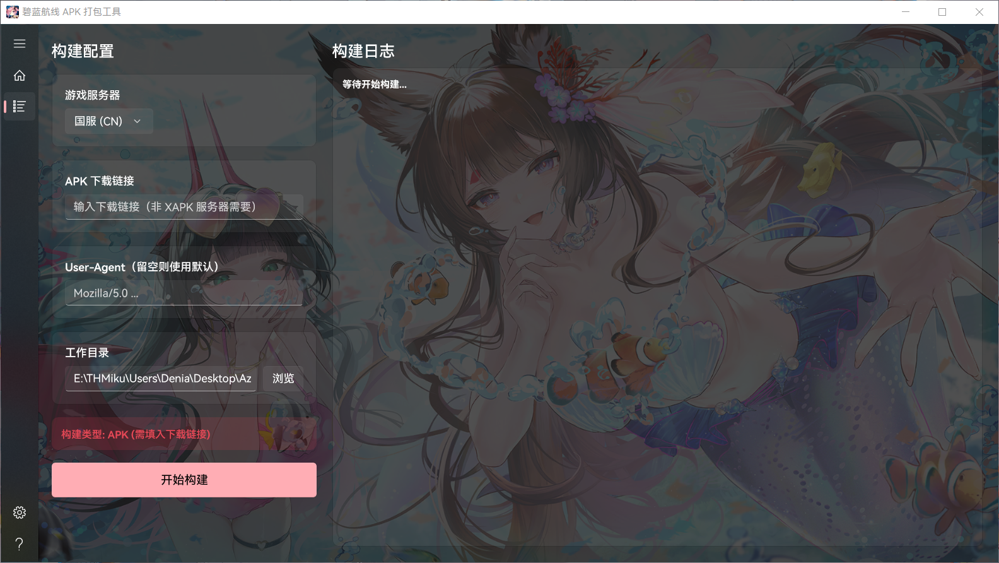
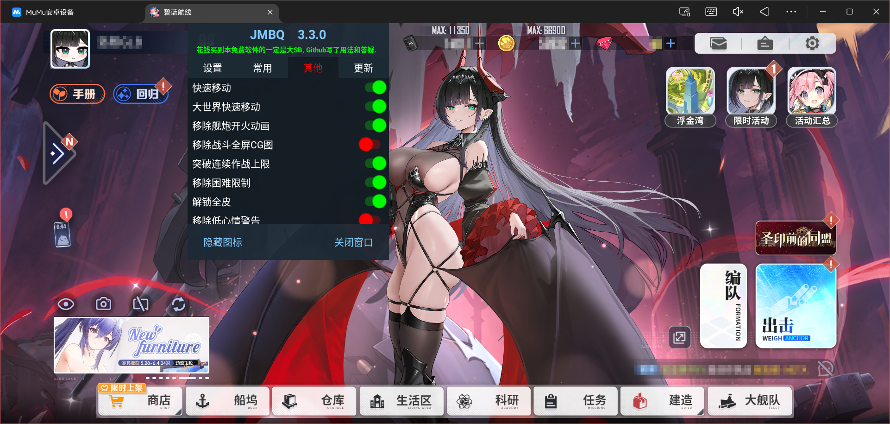

<div align="center">
  
  <h3 align="center">Azurlane Build</h3>

  
  
  
  <p align="center">
    使用 Github Workflow 一键构建对应区服的 APK/XAPK 安装包
    <br />
    <br />
    <a>发现问题？提交</a>
    <a href="https://github.com/Chtholly344/Azurlane-Build/issues">Issue</a>
  </p>

</div>

---

## 重要提示
本项目仅用于学习和研究，请在遵守相关法律法规的前提下使用本项目，若您违规使用使用本项目，那么所导致的一切后果将由您本人承担。

- **风险警告**：使用 Mod 可能涉及未知风险，如果您坚持使用，那么您将承担可能会造成的任何后果，包括但不限于您的游戏账号被封禁
- **登录问题**：重新打包的 APK 签名与官方版本不同，可能导致第三方授权登录失败。请优先使用二维码或验证码登录。

---

## Windows 一键打包工具预览
<div align="center">
    </br></br>
</div>

基于 .NET10 和 WInUI3，使用 DeepSeek V4 Pro 开发，可能存在大量 BUG，具体上传时间待定

---

## 项目目录
```

├── 📁 .github
│    └── 📁 workflows
│         ├── ⚙️ main.yml  # 国服构建流
│         └── ⚙️ xapk.yml  # 台服&外服构建流
├── 📁 images  # 图片
├── 📁 key  # 签名文件
│    ├── 📄 testkey.pk8
│    └── 📄 testkey.x509.pem
├── 📄 merge_build.sh  # 构建脚本
└── 📝 README.md

```

---

## 预览
<div align="center">
    </br></br>
</div>

---

## 已知问题
- **韩服**：启动无响应，可能触发反作弊机制。
- **华为服**：启动界面卡顿，已确认是由于 HMS Core 的签名验证问题导致。

---

## 相关仓库
1. [JMBQ/azurlane](https://github.com/JMBQ/azurlane)  
2. [n0k0m3/PerseusCI](https://github.com/n0k0m3/PerseusCI)

---

## Star历史
[](https://starchart.cc/Chtholly344/Azurlane-Build)
